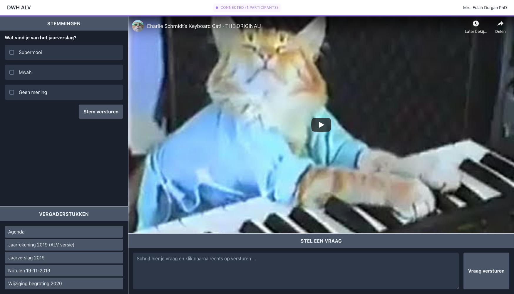
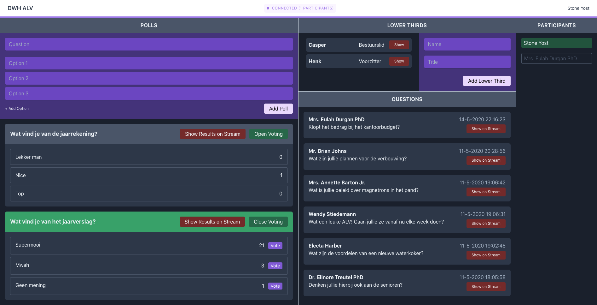

# ALV Platform

An application to support livestreams of general assemblies with voting, questions, member presence, and live graphics that can be used with video software like OBS, Wirecast or vMix.

The applications features a live area where members can watch the stream after logging in using a unique code.
The admin area provides controls for the live graphics, polls, and questions.

**Live Area**


**Admin Area**


## Getting Started and Usage

_The application is using a simple Laravel setup with very little customization, follow [Laravel's getting started guide](https://laravel.com/docs/7.x/installation) for more details on how to set the application up._

The application can be set up for local development using the built-in webserver, Laravel Valet, or any other tool of your preference.

All local configuration can be set up in a `.env` file, an example is provided.

All database types that are supported by Laravel can be used.
In production, MySQL is used.

Front-end assets are generated using Laravel Mix (`npm run dev`).

Web sockets are used to communicate realtime data to the front-end. The websocket server can be started using `php artisan websockets:serve`.

The repository is set up to auto-deploy. The contents of commits to master automatically end up on the production server.

## Testing
The application is equipped with tests. Please include tests in your contributions.

Use the following command to run the tests.
```
$ php artisan test
```

## Security

If you discover any security related issues, please email mail@casperboone.nl instead of using the issue tracker.

## Credits

- [Casper Boone](https://github.com/casperboone)
- [All Contributors](../../contributors)

## License

The MIT License (MIT). Please see [License File](LICENSE.md) for more information.
